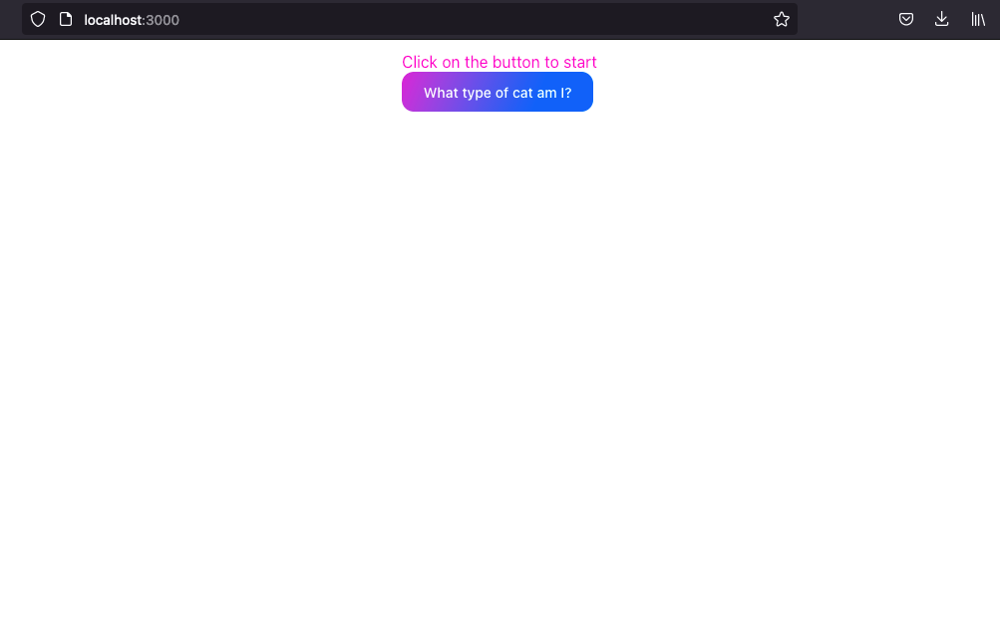
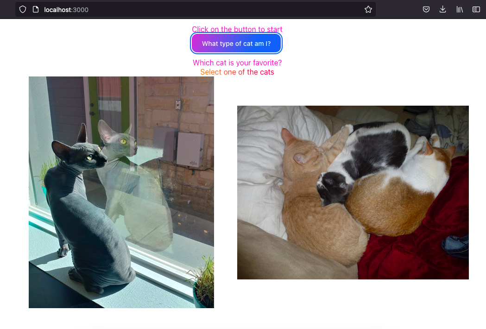
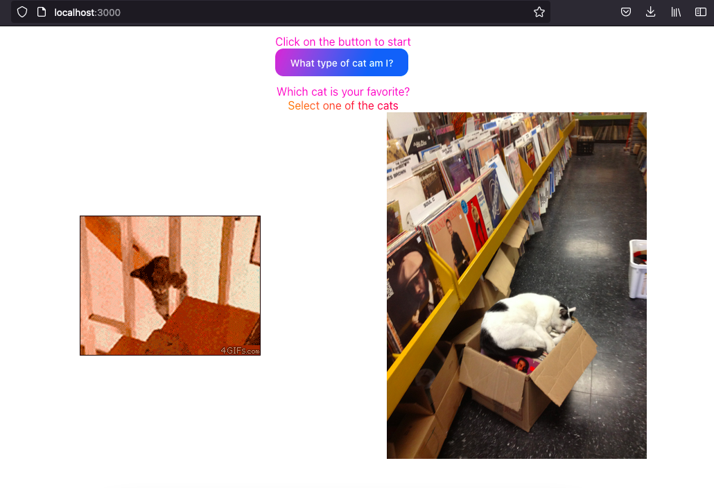
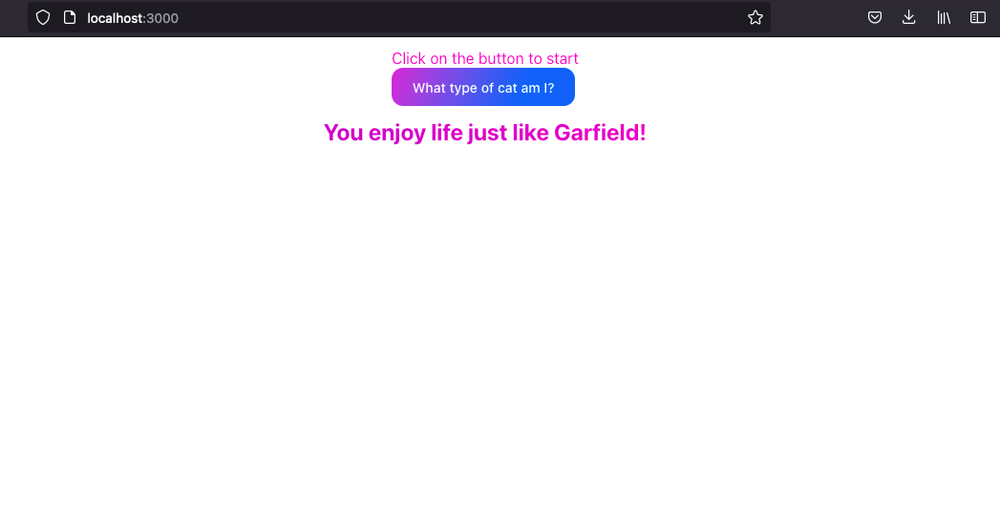

# Cat Quiz

The app renders a quiz where you choose a few cat images and your choices tell you about the type of cat you are. This an MVP version and it is under improvement. 

This project was bootstrapped with [Create React App](https://github.com/facebook/create-react-app).

## Requirements

* `Node` >= 16.15
* `Yarn`

## Quick Start

1. Create a copy of the `.env.example` file and rename the copy as `.env`. Replace the default value of the env with your API key;

2. Install the application dependencies by running:

```bash
yarn
```

3. Start the application by running:

```bash
yarn start
```

You should be able to open [http://localhost:3000](http://localhost:3000) and access the application.

## Application Screenshots




